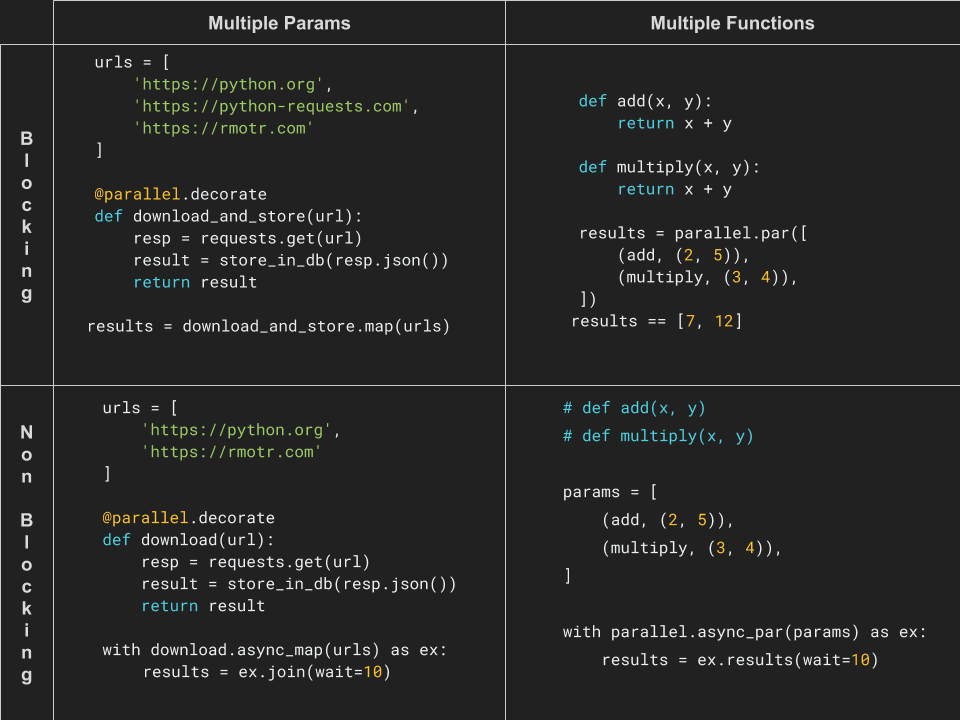

.. Parallel documentation master file, created by
   sphinx-quickstart on Thu Sep 20 17:56:08 2018.
   You can adapt this file completely to your liking, but it should at least
   contain the root `toctree` directive.

####################################
Parallel: Parallelism for Humans
####################################

Release v\ |version|.

.. note:: **❤️ Feature requests and questions are WELCOME ❤️**.

  Parallel is in early stage and your input is highly appreciated.

  Questions or ideas? Create `an issue <https://github.com/santiagobasulto/parallel/issues>`_.

`parallel` makes the process of writing parallel code simple and enjoyable,
bringing parallelism **closer to humans**. `parallel` is **NOT** a pipeline library (check `Dask <https://dask.org/>`_ or
`Luigi <https://github.com/spotify/luigi>`_ for that).

`parallel` is inspired (and perfectly summarized) by
`Scala's parallel collections <https://docs.scala-lang.org/overviews/parallel-collections/overview.html>`_:

  An effort to facilitate parallel programming by
  *sparing users from low-level parallelization details*, meanwhile providing
  them with a familiar and simple high-level abstraction.

  The hope was, and still is, that implicit parallelism behind
  a high-level abstraction will bring *reliable parallel execution one step
  closer to the workflow of mainstream developers*.

`parallel` lets you create instant, parallelizable functions with
amazing simplicity::

    @parallel.decorate
    def download_and_store(url):
        resp = requests.get(url)
        result = store_in_db(resp.json())
        return result

    urls = [
        'https://python.org',
        'https://python-requests.com',
        'https://rmotr.com'
    ]
    # instant parallelism (Threads used by default)
    results = download_and_store.map(urls, timeout=5, max_workers=4)

Parallel includes a simple way to switch between
multithreading and multiprocessing::

    # Using the default executor (thread)
    # (can be configured when writing the function)
    results = download_and_store.map(urls)

    # Add `.thread` to use multithreading
    results = download_and_store.thread.map(urls)

    # Add `.process` to use multiprocessing
    results = download_and_store.process.map(urls)

**Warning:** Multiprocessing support is in alpha stage. I had to rewrite a
module similar to `concurrent.futures` because pickling doesn't work with
decorated functions.

Decorating your function won't affect its regular behavior.
The decorated function can still be used normally::

    res = download_and_store('https://rmotr.com')

Existing functions (not decorated), can also be parallelized with
the same simplicity::

    def download_and_store(url):
        # Same function as before, not decorated
        pass

    results = parallel.map(download_and_store, urls)

Non Blocking API
------------------

Parallel also includes a non Blocking API, with similar simplicity::

    params = {
        'python': 'https://python.org',
        'RMOTR': 'https://rmotr.org',
    }

    with download_and_store.async_map(params) as ex:
        # do something else here, when ready, ask for results
        results = executers.results(timeout=10)

    results['python']

Parallelizing Multiple functions
------------------------------------

Parallel can also be used to run multiple **different functions** in parallel,
with advanced argument passing and a simplified API::

    @parallel.decorate
    def sum(a, b):
        return a + b

    @parallel.decorate
    def multiply(a, b):
        return a * b

    @parallel.decorate
    def square(a, pretty=False):
        return a ** 2

    results = parallel.par([
        sum.future(2, 2),
        multiply.future(3, 4),
        square.future(4, pretty=True)
    ])
    results == [4, 12, 25]

Functions that are not decorated can be passed as tuples, or using the
``parallel.future`` helper::

    results = parallel.par([
        (sum, 2, 2),
        (multiply, 3, 4),
        (square, 4, {'pretty': True}),

        # instead of passing tuples, use `future`s:
        parallel.future(sum, 2, 2),
        parallel.future(square, 4, pretty=True),
    ])
    results == [4, 12, 25]

There's far more to Parallel than what we've just shown, a few examples:

* `*args`, and `**kwargs` function arguments (knwon shortcoming of ``concurrent.futures``)
* Error handling and recovering
* Automatic retries
* A non-blocking API
* Parallelism with multiprocessing or multithreading

---

Refer to the following quickstart guides:

.. toctree::
   :maxdepth: 2

   user/quickstart-same-function
   user/quickstart-multiple-functions

Quick functionality matrix summary:

.. toctree::
   :maxdepth: 2
   :caption: Contents:

